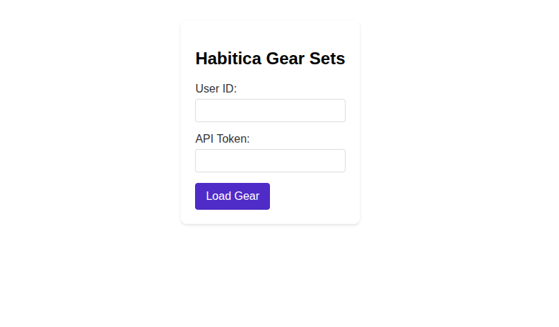
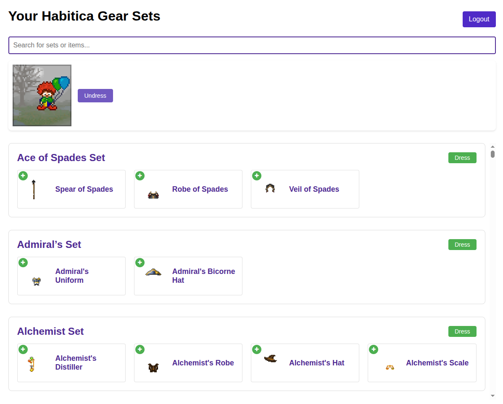
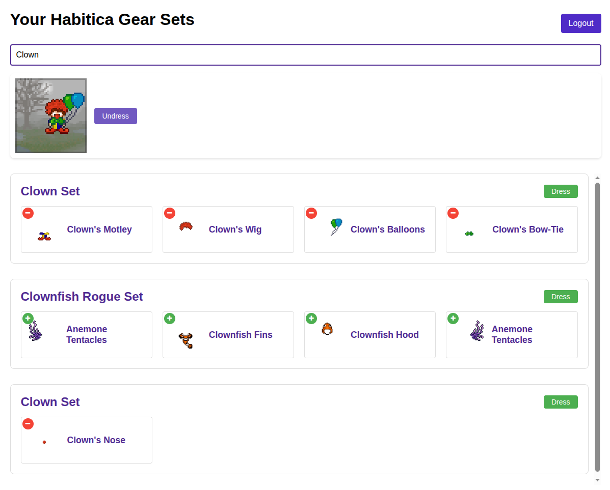

# Habitica Gear Sets

A web-based tool for managing and visualizing your Habitica gear sets. This tool allows you to easily view, organize, and equip your Habitica gear sets with a user-friendly interface.

> 🌟 This project was fully vibe-coded using claude sonnet! ✨

## Features

- **Visual Gear Management**: View all your owned gear sets with their respective items
- **Easy Set Equipping**: One-click button to equip entire sets
- **Individual Item Toggle**: Toggle individual items on/off with convenient +/- buttons
- **Live Avatar Preview**: See your current costume on a live-updating avatar preview
- **Quick Undress**: Easily remove all equipped costume items
- **Search Functionality**: Search through your sets and items to find specific pieces
- **Set Organization**: Sets are organized by type, with multi-item sets displayed first
- **Secure Authentication**: Uses Habitica's API authentication with local storage support
- **Responsive Design**: Works on both desktop and mobile devices

## Screenshots

*Login screen with User ID and API Token inputs*

*Main interface showing gear sets and current costume*

*Example of the search functionality*

## Setup

1. Visit the application in your web browser
2. You'll need your Habitica User ID and API Token:
   - Log into [Habitica](https://habitica.com)
   - Go to Settings → API
   - Copy your User ID and API Token
3. Enter these credentials in the login form
4. Your gear sets will be loaded automatically

## Usage

- **View Sets**: Scroll through your available gear sets
- **Search**: Use the search box to filter sets or items
- **Equip Set**: Click the "Dress" button on any set to equip all items
- **Toggle Items**: Use the +/- buttons on individual items to equip/unequip them
- **Undress**: Click the "Undress" button to remove all costume items
- **Logout**: Use the logout button to clear your credentials

## Privacy & Security

- Your Habitica credentials are stored locally in your browser
- No data is sent to any third-party servers
- All communication is directly between your browser and Habitica's servers
- You can clear your stored credentials at any time using the logout button

## Technical Details

- Built with HTML, CSS, and JavaScript
- Uses jQuery for DOM manipulation and AJAX requests
- Communicates with Habitica's API v3
- Supports modern browsers with local storage capabilities
- Falls back to cookies when local storage is not available

## Contributing

Feel free to submit issues and enhancement requests!

## License

This project is licensed under the MIT License - see the [LICENSE](LICENSE) file for details.